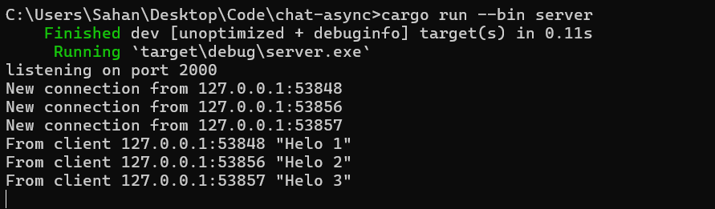

2.1. Original code of broadcast chat.
- Server

- Client


Kita menjalankan client dan server dengan menjalankan perintah cargo run --bin server dan cargo run --bin client. Disini saya menjalankan satu server dan tiga client. Tiap client terhubung dengan server yang sama. Tiap client juga dapat mengirim pesan di dengan mengetik pesan di terminal dan menekan tombol enter. Pesan yang dikirim akan diterima oleh server dan diteruskan ke semua client yang terhubung.

2.2. Modifying the websocket port

- Server

- Client


Karena kita mengubah port websocket menjadi port 8080 pada client.rs, maka kita juga harus mengubah port websocket pada server.rs menjadi port 8080. Berikut adalah kode yang saya modifikasi pada server.rs

````
#[tokio::main]
async fn main() -> Result<(), Box<dyn Error + Send + Sync>> {
    let (bcast_tx, _) = channel(16);

    let listener = TcpListener::bind("127.0.0.1:8080").await?;
    println!("listening on port 8080");
    ...
````
Dengan mengubah port tersebut, maka server dan client dapat berkomunikasi kembali tanpa error. Jika tidak, maka client akan menunjukkan error seperti pada gambar ini. Pesan error menunjukkan kalau tidak ada koneksi yang dapat dibuat


2.3. Small changes. Add some information to client
