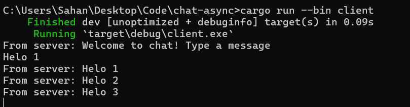

2.1. Original code of broadcast chat.
- Server

- Client

Kita menjalankan client dan server dengan menjalankan perintah cargo run --bin server dan cargo run --bin client. Disini saya menjalankan satu server dan tiga client. Tiap client terhubung dengan server yang sama. Tiap client juga dapat mengirim pesan di dengan mengetik pesan di terminal dan menekan tombol enter. Pesan yang dikirim akan diterima oleh server dan diteruskan ke semua client yang terhubung.

2.2. Modifying the websocket port

2.3. Small changes. Add some information to client